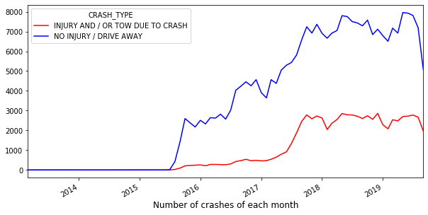

<h1>Table of Contents</h1>

<ul class="toc-item"><li><a href="#Data-Wrangling" data-toc-modified-id="Data-Wrangling-1">1&nbsp;&nbsp;Data Wrangling</a><ul class="toc-item"><li><a href="#First-Step:-Removing-redundant-columns" data-toc-modified-id="First-Step:-Removing-redundant-columns-1.1">1.1&nbsp;&nbsp;First Step: Removing redundant columns</a></li><li><a href="#Second-Step:-Filling-the-missing-entries" data-toc-modified-id="Second-Step:-Filling-the-missing-entries-1.2">1.2&nbsp;&nbsp;Second Step: Filling the missing entries</a></li><li><a href="#Third-Step:-Dealing-with-remaining-columns" data-toc-modified-id="Third-Step:-Dealing-with-remaining-columns-1.3">1.3&nbsp;&nbsp;Third Step: Dealing with remaining columns</a></li></ul></li><li><a href="#Data-Exploration" data-toc-modified-id="Data-Exploration-2">2&nbsp;&nbsp;Data Exploration</a><ul class="toc-item"><li><a href="#Injury-and-No-Injury-Crashes-Across-the-Features" data-toc-modified-id="Injury-and-No-Injury-Crashes-Across-the-Features-2.1">2.1&nbsp;&nbsp;Injury and No Injury Crashes Across the Features</a><ul class="toc-item"><li><a href="#Posted-Speed-Limit" data-toc-modified-id="Posted-Speed-Limit-2.1.1">2.1.1&nbsp;&nbsp;Posted Speed Limit</a></li><li><a href="#Traffic-Control-Device" data-toc-modified-id="Traffic-Control-Device-2.1.2">2.1.2&nbsp;&nbsp;Traffic Control Device</a></li><li><a href="#Weather-Conditions" data-toc-modified-id="Weather-Conditions-2.1.3">2.1.3&nbsp;&nbsp;Weather Conditions</a></li><li><a href="#Lighting-Conditions" data-toc-modified-id="Lighting-Conditions-2.1.4">2.1.4&nbsp;&nbsp;Lighting Conditions</a></li><li><a href="#Road-Alignment" data-toc-modified-id="Road-Alignment-2.1.5">2.1.5&nbsp;&nbsp;Road Alignment</a></li><li><a href="#Road-Surface-Conditions" data-toc-modified-id="Road-Surface-Conditions-2.1.6">2.1.6&nbsp;&nbsp;Road Surface Conditions</a></li><li><a href="#First-Collision-Type" data-toc-modified-id="First-Collision-Type-2.1.7">2.1.7&nbsp;&nbsp;First Collision Type</a></li><li><a href="#Trafficway-Type" data-toc-modified-id="Trafficway-Type-2.1.8">2.1.8&nbsp;&nbsp;Trafficway Type</a></li><li><a href="#Contributory-Causes" data-toc-modified-id="Contributory-Causes-2.1.9">2.1.9&nbsp;&nbsp;Contributory Causes</a></li></ul></li><li><a href="#Change-of-Crashes-Across-Time" data-toc-modified-id="Change-of-Crashes-Across-Time-2.2">2.2&nbsp;&nbsp;Change of Crashes Across Time</a></li><li><a href="#Measures-of-Association-between-Crash-Type-and-Crash-Features" data-toc-modified-id="Measures-of-Association-between-Crash-Type-and-Crash-Features-2.3">2.3&nbsp;&nbsp;Measures of Association between Crash Type and Crash Features</a><ul class="toc-item"><li><a href="#Association-between-the-Features" data-toc-modified-id="Association-between-the-Features-2.3.1">2.3.1&nbsp;&nbsp;Association between the Features</a></li></ul></li><li><a href="#Crashes-on-Chicago-Map" data-toc-modified-id="Crashes-on-Chicago-Map-2.4">2.4&nbsp;&nbsp;Crashes on Chicago Map</a><ul class="toc-item"><li><a href="#Points-Locations-of-Chicago-Crashes" data-toc-modified-id="Points-Locations-of-Chicago-Crashes-2.4.1">2.4.1&nbsp;&nbsp;Points Locations of Chicago Crashes</a></li><li><a href="#Crash-Distribution-across-Chicago-Areas" data-toc-modified-id="Crash-Distribution-across-Chicago-Areas-2.4.2">2.4.2&nbsp;&nbsp;Crash Distribution across Chicago Areas</a></li><li><a href="#Global-Moran's-I" data-toc-modified-id="Global-Moran's-I-2.4.3">2.4.3&nbsp;&nbsp;Global Moran's I</a></li><li><a href="#Local-Moran's-I" data-toc-modified-id="Local-Moran's-I-2.4.4">2.4.4&nbsp;&nbsp;Local Moran's I</a></li><li><a href="#Location-as-a-feature-for-the-crashes" data-toc-modified-id="Location-as-a-feature-for-the-crashes-2.4.5">2.4.5&nbsp;&nbsp;Location as a feature for the crashes</a></li></ul></li><li><a href="#Key-Findings" data-toc-modified-id="Key-Findings-2.5">2.5&nbsp;&nbsp;Key Findings</a></li></ul></li><li><a href="#In-Depth-Analysis---Building-the-predictive-model" data-toc-modified-id="In-Depth-Analysis---Building-the-predictive-model-3">3&nbsp;&nbsp;In-Depth Analysis - Building the predictive model</a><ul class="toc-item"><li><a href="#Data-Splitting" data-toc-modified-id="Data-Splitting-3.1">3.1&nbsp;&nbsp;Data Splitting</a></li><li><a href="#Cramer's-V-Coefficient-of-the-Features" data-toc-modified-id="Cramer's-V-Coefficient-of-the-Features-3.2">3.2&nbsp;&nbsp;Cramer's V Coefficient of the Features</a></li><li><a href="#Encoding-Categorical-Features" data-toc-modified-id="Encoding-Categorical-Features-3.3">3.3&nbsp;&nbsp;Encoding Categorical Features</a></li><li><a href="#Performance-of-the-Trained-Models---without-Undersampling" data-toc-modified-id="Performance-of-the-Trained-Models---without-Undersampling-3.4">3.4&nbsp;&nbsp;Performance of the Trained Models - without Undersampling</a></li><li><a href="#Models'-Training-with-Undersampling" data-toc-modified-id="Models'-Training-with-Undersampling-3.5">3.5&nbsp;&nbsp;Models' Training with Undersampling</a><ul class="toc-item"><li><a href="#Balanced-Random-Forest-Classifier" data-toc-modified-id="Balanced-Random-Forest-Classifier-3.5.1">3.5.1&nbsp;&nbsp;Balanced Random Forest Classifier</a></li><li><a href="#Training-with-Undersampling" data-toc-modified-id="Training-with-Undersampling-3.5.2">3.5.2&nbsp;&nbsp;Training with Undersampling</a><ul class="toc-item"><li><a href="#Concluding-Remarks" data-toc-modified-id="Concluding-Remarks-3.5.2.1">3.5.2.1&nbsp;&nbsp;Concluding Remarks</a></li></ul></li></ul></li><li><a href="#Fine-Tuning-and-Model-Selection" data-toc-modified-id="Fine-Tuning-and-Model-Selection-3.6">3.6&nbsp;&nbsp;Fine-Tuning and Model Selection</a><ul class="toc-item"><li><a href="#Performance-of-Selected-Model-on-Testing-Set" data-toc-modified-id="Performance-of-Selected-Model-on-Testing-Set-3.6.1">3.6.1&nbsp;&nbsp;Performance of Selected Model on Testing Set</a></li><li><a href="#Focus-on-the-Known-Primary-Contributory-Cause" data-toc-modified-id="Focus-on-the-Known-Primary-Contributory-Cause-3.6.2">3.6.2&nbsp;&nbsp;Focus on the Known Primary Contributory Cause</a></li></ul></li></ul></li><li><a href="#Possible-Additional-Works" data-toc-modified-id="Possible-Additional-Works-4">4&nbsp;&nbsp;Possible Additional Works</a></li><li><a href="#Recommendations" data-toc-modified-id="Recommendations-5">5&nbsp;&nbsp;Recommendations</a></li></ul>

# Predicting Crash Severity on City Streets of Chicago

Traffic crashes are one of the leading causes of death in the US. Each year, tens of thousands of women and men are killed or injured in traffic accidents. In Chicago for example, more than 2,000 people were killed or seriously injured in 2016 traffic crashes, with an average of five people seriously injured each day and one person killed every three days. City departments are continually making efforts to improve roadway safety and to reduce fatalities and serious injuries. One of these efforts is based on data-driven models that aim to understand the factors and causes of traffic collisions, and reveal any pattern or trend from past accidents. 

The city of Chicago has made available Online, through its [portal](https://data.cityofchicago.org/Transportation/Traffic-Crashes-Crashes/85ca-t3if), a description of the crashes that occurred within the city. The data contains information about each traffic crash on city streets of Chicago from 2015 to present, including the time and location of the crash, weather, road and lighting conditions, type of crash and its primary cause, injuries and damage, etc. The data also specifies whether the crash produced injuries or not. By looking into this dataset, we aim at exploring the circumstances and conditions of the crashes that led to injuries, and building a model that predicts crash severity.

The city of Chicago can use the model to understand the leading factors of crash severity and to identify any risky driving behaviors. In this way, the model can help them decide on whether to improve the infrastructure, to incorporate more safety features on the roads or to develop better traffic control policies. Moreover, the model can help vehicle manufacturers to know what kinds of safety features can be incorporated in the design of the vehicle to increase the safety and awareness of the drivers. Insurance companies can also learn from the insights provided by the model in its risk assessment and in providing better insurance policies.

This report is divided as follows. We first describe the data and focus on cleaning it to make it ready for crash severity analysis. In particular, we explain how we handled the presence of missing values and outliers that could have occurred in the data due to human errors. After we clean the data of Chicago crashes, we visually and statistically explore the information provided by the data, to see how the conditions of a crash change according to its severity and to examine if there is any pattern in the occurrence of Chicago crashes. We end up with building a predictive model for crash severity.

## Data Wrangling

In this section, we describe the steps done to clean the dataset of [Chicago Traffic Crashes](https://data.cityofchicago.org/Transportation/Traffic-Crashes-Crashes/85ca-t3if). The main issue with the data is that it includes some missing values and outliers due to human errors. In this section, we explain how we handled this issue and made the data ready for crash severity analysis. (The Jupyter notebook of this section can be found [here](https://github.com/hsalami/Springboard/blob/master/Capstone%20Project%201/Data%20Wrangling/Code.ipynb)).

### First Step: Removing redundant columns

We first removed all irrelevant and mostly empty columns. The obtained data consists of the following columns:

1. Identification number of the crash;
2. Location information: street number, direction and name, beat of occurrence, latitude and longitude of the crash location;
3. Time information: the date, month, hour, and day of the week of the crash; 
4. Crash description and conditions: posted speed limit, traffic control device and its condition, weather condition, lighting condition, first collision type, traffic-way type, roadway surface condition, alignment of the road, primary contributory causes;
5. Crash damage and injuries: crash type (1- no injury/drive away or 2- injury or/and tow due to crash), damage cost in dollars, type of the most severe injury.

Some of these columns contain some missing or unknown entries and some outliers. The strategies we followed to deal with missing entries are either deducing their values from the available data or leaving them as an 'unknown/other' category. The latter strategy was followed to avoid removing the corresponding rows of the missing entries and thus to avoid losing any possible information from other columns, especially when there is a large number of unknown entries. We next describe what entries we were able to fill and what entries we left as an additional category.

### Second Step: Filling the missing entries

We describe how we filled some of the missing entries.

- **Posted Speed Limit**: This column indicates the posted speed limit (in miles per hour (MPH)) for the crash location. By checking the values of this column, we notice that some values are 0 or 99, which are considered as unreasonable numbers for the speed limit. To replace these values with reasonable ones, we first checked the column of the traffic-way type, which clarifies the location type of the crash (parking lot, driveway, alley, divided or undivided highway, ...). If the location of the crash is a parking lot, driveway or alley, we adjusted the speed limit to 15 MPH. On the other hand, by checking the name of the street, if the street is a highway or expressway, we adjusted the speed limit to 55 MPH. The remaining streets are assumed to have 30 MPH as speed limit (30 MPH is the speed limit of the most city streets of Chicago and it represents the maximum speed limit when there is no posted speed limit). We then regrouped the speeds into the following values: 10, 15, 20, 25, 30, 35, 40, 45, 50, 55, 60, 65 and 70. This is because there were some values in between these numbers (18, 23, 36, ...) which are not considered as common posted speed limits and which we believe are caused because of human errors.

- **Weather Condition**: The possible weather conditions reported at the time of the crash include: rain, clear, ice, snow, wind, ... The unknown entries of this column were deduced from the date and time of the crash. More specifically, by checking the reported weather conditions of other crashes that happened during the same day, the unknown weather condition of the same day crash was filled accordingly. If more than weather conditions were reported for the same day, we took the most common weather condition. Only three crashes with unknown weather conditions remained unknown, as no other crashes happened during the same day. Since the total number of crashes is around 340k, 3 crashes represent a tiny percentage of the whole data, therefore we removed the three rows with unknown weather conditions.

- **Lighting Condition**: The possible lighting conditions are: daylight, darkness, dusk, dawn. The unknown entries for this column were deduced from the time and month of the crash.

- **Roadway Surface Condition**: The possible road conditions include: dry, wet, snow or ice, etc... The unknown entries for this column were deduced from the weather condition of the crash. More specifically, if the weather condition is 'rain', the road condition is set to 'wet'. If the weather condition is 'snow' or 'sleet/hail', the road condition is set to 'snow or slush'. If the weather condition is 'freezing rain', the road condition is set to 'ice'. Otherwise, the road condition is set to 'dry'.

### Third Step: Dealing with remaining columns

We describe next the remaining columns with unknown entries which were not possible to be filled and which we preferred keeping as an additional category.

- **Traffic-way type**: This column describes the type of the street location where the crash happened: divided, not divided, one way, parking lot, alley, driveway, ramp, intersection, roundabout,.... However around 3.8k entries are reported as 'unknown' and 34 as 'not reported'. There is no available data for this type of information for the city streets of Chicago. For now, we leave them as an additional category for future deep analysis.

- **Traffic control device**: This column clarifies whether there was a traffic control device (traffic signal, stop sign, yield, railroad crossing, ...) or not at the crash location. However 10k entries are reported as 'unknown', which we also leave as an additional category. Moreover, we grouped the following categories: 'RAILROAD CROSSING GATE','OTHER RAILROAD CROSSING', 'RR CROSSING SIGN' as one category labeled as 'railroad crossing sign'.

- **Device condition**: This column indicates whether the traffic control device was working or not (no control, functioning properly or improperly or not functioning). We first made sure that this column and the previous one (traffic control device) are consistent, so that they both show similar entries when there was no control device. In this column, 16k entries were reported as 'unknown'. We also leave these entries for future deep analysis.

- **Primary contributory causes**: This column includes a lot of possible entries that describe the primary driver's behavior that led to the crash (improper backing, following too closely, improper turning, reckless driving,...). However, around one third of the entries (110K) are reported as 'unable to determine'. We also leave them for future analysis and to investigate if there is any type of driver's behavior that can lead to a severe crash.

The remaining two columns: **alignment of the street** (straight, curve,...) and **first crash type** (angle, sideswipe, rear to rear, rear end,....) have no missing entries.

## Data Exploration

After having cleaned the data of Chicago crashes, we now explore the information provided by the data, to see how the conditions of a crash change according to its severity and to examine if there is any pattern in the occurrence of Chicago crashes. (The Jupyter notebook of this section can be found [here](https://github.com/hsalami/Springboard/blob/master/Capstone%20Project%201/Data%20Storytelling/Data%20Story%20-%20Chicago%20Crashes.ipynb)).

The data consist of the following information for each crash: weather, road, and lighting conditions, posted speed limit, control device, road alignment, traffic-way type, time, location and contributory causes of each crash. Moreover, the crashes are divided into two types: 1-'INJURY AND / OR TOW DUE TO CRASH' and 2-'NO INJURY / DRIVE AWAY'. In the sequel and for brevity, we refer to the first crash type as 'injury' crashes and to the second crash type as 'no injury' crashes. Using this information, we address the following questions: how do the weather conditions contribute to the severity of the crash, and how can the road types, conditions and curvatures affect the crash severity? Do crashes with injury occur more in high speed streets or normal streets? What driving behaviors can lead to severe crashes? Is the presence of a control device limit the occurrence of crashes? Is there any time or day or season of the year where severe crashes are more likely to occur? How are the severe crashes spread across the city of Chicago? What places are more prone to severe crashes? 

In this section, we try to answer these questions by exploring the data as follows:
- For each crash feature or descriptor, we plot how each crash type is distributed across the different categories of the feature, in order to examine if there are any differences between the factors of 'injury' and 'no injury' crashes; 
- We also plot how each type of crash is changing over time and across the days of the week;
- We then statistically analyze the relationship between each crash feature and its type, to test for any significant association. 
- We finally show a map of Chicago with the locations of the two types of crashes. We show density plot of each crash type and we also show how the crashes are divided into the community areas of Chicago. We also study the statistical significance of the spatial patterns of the crashes on the map.

### Injury and No Injury Crashes Across the Features

We first check how each crash type differ across the features. For each feature, we plot the distribution of each crash type to see if there are any differences and what conditions can possibly lead to crashes with injuries. 

#### Posted Speed Limit
We start with the posted speed limit. We check how injury and no injury crashes are distributed across the possible values of posted speed limit, and see if the speed limit of the streets is associated with the type of crashes and at what speed limits crashes with injuries are more concentrated.

We see from the plot how most of the crashes of either type correspond to a posted speed limit of 30 mph. This might be because most of Chicago streets have 30 mph as speed limit. We also see that with speeds of 35, 40 and 45 mph as well as 60, 65 and 70 mph, their proportions out of the injury crashes are slightly higher than those of no injury crashes. On the other hand, lower speeds of 10 and 15 mph have greater contribution in percentage to no injury crashes than to injury crashes.

#### Traffic Control Device
We now consider the presence of traffic control device at the location of the crash and check whether its presence can be related to the type of crash that occurred.

We notice that for both types of crashes, most of the crashes happen when there was no control device. However, the proportions of the following two devices: traffic signal and the stop sign are greater with injury crashes than those of no injury crashes. This might be related to the fact that traffic signal and stop sign are present at intersection where severe crashes are more likely to occur.

#### Weather Conditions
We now consider the weather conditions for both types of crashes and check if any weather condition can be related to crashes with injury.

We see from the plots that most crashes, even the ones with injury, occurred when the weather was clear. This might suggest that people are more careful with their driving when the weather is not clear. However, we see that the proportions of the following weather conditions: rain, cloudy and sleet are slightly higher with injury crashes than with no injury crashes.

#### Lighting Conditions
We now check the lighting conditions, which describes how lighted the road was during the crash. It is interesting to know where crashes with injuries happened most compared to crashes with no injuries. 

We see that most of the crashes happened during daylight, which is expected because most of the commute time happen during the day. However, we see that the proportions of darkness with lighted road and dawn are higher with injury crashes. 

#### Road Alignment
We now check the crash type with respect to the road alignment, which specifies whether the road is aligned or curved. We here check at which road alignment, each crash type occurred.

We notice that the majority of crashes of either type occurred on straight and level roads. However, we notice the proportions of other types of alignment of injury crashes are slightly higher than those with no injury crashes. This might be explained by the fact that most of Chicago streets are straight and level, which might suggest that his feature might not be helpful in determining the severity of a crash.

#### Road Surface Conditions
We now check the road conditions for each type of crash, and see how each crash type is distributed according to the road surface condition.

Similarly to weather conditions, we also notice here that most of the crashes happened on dry surface roads. However, the proportions of the following two conditions: wet and ice are higher with injury crashes.

#### First Collision Type
This feature specifies the type of collision that happened whether it was from the side or from the rear, etc. We now examine the crash type with respect to the collision type.

We immediately see for this feature, the noticeable difference in distribution of each crash type. In particular, we notice how turning, angle collision and collision with pedestrian or pedalcyclist or fixed object contribute more to crashes with injury. On the other hand, sideswipe collision and accidents with parked motor vehicle contribute less to crashes with injury.

#### Trafficway Type
We now check the trafficway type for each crash type. The trafficway type describes the type of street location of the crash. 

While most of the crashes occurred in non divided road, we see higher proportions for divided roads, four way and center turn lane with injury crashes than with no injury crashes. Moreover, we notice that parking lot collisions contribute less to injury crashes. 

#### Contributory Causes
This feature describes the contributory cause of the crashes which includes driving behaviors or external conditions.

Similarly to the feature of collision type, we see a noticeable difference in the distribution of each crash type. We notice how the following causes: failing to yield the right of way, failing to reduce speed, and disregarding traffic signals or stop sign contribute more to injury crashes. On the other hand, improper backing and overtaking or following too closely contribute less to crashes with injury.

By comparing how each type of crash distributes across the different categories of each feature, we notice a great difference in the crash distributions with the two following features: contributory causes and first collision type. In particular, we notice that behaviors such as disregarding traffic signal or failing to reduce speed or not giving the right-of-way, as well as collision types such as angle or turning or pedestrian collisions, are all factors that contributed more in percentage to crashes with injury. With the remaining features, we figure out some slight differences between the two types of crashes. We find that the following factors: higher speed streets, the presence of traffic signal or stop sign, raining weather, darkness, are all factors that contributed slightly more in percentage to crashes with injury. On the other hand, theses crashes happened less with parked cars, and when the first collision is sideswipe in the same direction.

Before we examine how much statically significant these differences are, we check how the number of crashes is changing with time, as well as with the days and hours of the week.  

### Change of Crashes Across Time

We are now interested in examining the presence of any trend in the occurrence of Chicago crashes through time. we plot how the number of each type of crashes is changing from month to month over the years, by counting the number of crashes that happened during each month. 

We see that starting from to 2017, the number of crashes reported increased this is because data from E-Crash are available for some police districts in 2015, but citywide data are not available until September 2017 (according to the website of Chicago city). We now plot the change in number of crashes starting from September 2017 till August 2019.

Both types of crashes exhibit similar behavior across the months. Interestingly, both types of crashes decrease in February and then increase again during summer. We now check to see if there are any specific hours of the week where more crashes occur. For this sake, we plot how the number of each type of crashes varies across the hours of each day of the week. 

We see that for both types of crashes, during any business day (Monday to Friday), the number of crashes increases in the morning between 7 and 8 am and in the afternoon during the rush hours. During the weekend, for both of type of crashes we see decrease in the number of crashes in the morning at around 7 to 8 am and then an increase in the number of crashes at around 2 pm. We also notice that during the early hours of the day (around 2-3 am), for both types of crashes, the number of crashes during the weekend is higher than that during any business day. However, with injury crashes, we see peaks in the number of crashes at around 2-3 am that are close (in value) to the peaks of some normal business days during the morning and afternoon rush hours. On the other hand, with no injury crashes, we do not see peaks after midnight during the weekend.

After having examined through data visualization the presence of any possible relationship between crash type and crash features, we now test how much this association is statistically significant.

### Measures of Association between Crash Type and Crash Features
We now statically explore the association between crash type and each crash feature. One way to test the association between categorical variables is to perform the chi-square test. However, this type of test is very sensitive to sample size, and might not help in clarifying the strength of the association between crash type and each crash feature. To gain more insight into the relationship between crash type and each feature, we compute other measure of association based on the chi-square test statistic, namely, Cramer's V Coefficient. The obtained measures are given in the table below.

| Crash Features         | Cramer's V |
|------------------------|------------|
| Collision Type         | 0.354616   |
| Contributory Cause     | 0.305592   |
| Trafficway Type        | 0.166278   |
| Crash Hour             | 0.140416   |
| Lighting Condition     | 0.132488   |
| Speed Limit            | 0.127317   |
| Traffic Control Device | 0.121551   |
| Road Surface Condition | 0.064011   |
| Weather Condition      | 0.057036   |
| Alignment              | 0.056187   |
| Crash Day of Week      | 0.039289   |
| Crash Month            | 0.022613   |

We notice the following:
- collision type and contributory cause have the two highest Cramer's V coefficient (0.354616 and 0.305592 respectively). This result is consistent with the visualizations where with these two features, we noticed the greater differences in the distribution of each crash type; 
- trafficway type (0.166278) comes next, then hour (0.140416), light, speed and device (0.132488, 0.127317, 0.121551 respectively). These features have similar Cramer's V values and reflect the possible presence of an association between these features and the crash type;
- weather conditions, road surface condition, road alignment, day and month are the features with lowest Cramer's V, which might imply weaker relationship between those features and the crash type.

#### Association between the Features
We now look for any association between the features by computing the Cramer's V coefficient and plot the result in a heatmap.

We see a strong association between lighting condition and crash hour which is expected since whether there is light or darkness is related to the crash hour. We also see a strong association between weather condition and roadway surface condition, which is also expected since whether the road is wet or dry is related to whether it is clear or raining.

After having examined the association between crash type and each crash feature, we now move to spatial analysis of crashes, in order to see if there is any spatial patterns in the occurrence of Chicago crashes.

### Crashes on Chicago Map
We are now interested in checking the locations of Chicago crashes to see if there is any spatial patterns for injury and no injury crashes, and if there are any places that are more prone to crashes with injury.

#### Points Locations of Chicago Crashes
We first show the map of the locations of each type of Chicago crashes (point plot).

From the two maps, we see that for both types of crashes, many of them were focused in the downtown area of Chicago. However, it is hard to catch any pattern from the pointplot. To gain better understanding of the distribution of the locations of each crash type, we can plot the kernel density estimation for each crash type. This technique estimates the distribution functions for the locations of each crash type.

We see that crashes with no injury are mostly focused in the downtown area. On the other hand, injury crashes are more spread out, where we see more crashes to the left side of downtown area.

Another way to explore the distribution of crashes locations is to check their distributions with respect to Chicago community areas. 

#### Crash Distribution across Chicago Areas
The city of Chicago is divided into 77 community areas. Let us see how the crashes of both types are distributed across the community areas of Chicago. For each community area, we count the number of injury and no injury crashes that occurred in the given area and then displays the counts on Chicago map (using choropleth() function).

We see that the highest number of injury crashes is for the west side area of Chicago: "Austin". On the other hand, the highest number of no injury crashes is for the central area: "Near North". We also see that while no injury crashes are more focused in the central part of Chicago, injury crashes are more spread out across the areas. In other words, we notice a relatively high concentration of Chicago crashes in non-central part of Chicago (for instance in the south area: "Great Grand Crossing").

We next analyze whether the observed patterns of the locations of injury crashes are statistically significant (i.e., the map's pattern for injury crashes is not spatially random), by computing some indicators of spatial association or correlation. One example of such indicators is Moran's I statistic, which can be global or local. Global Moran's I can be used to evaluate the similarity, across Chicago areas with respect to the frequency of injury crashes. In other words, are areas with similar frequency of injury crashes located close together or are injury crashes randomly distributed across the areas of Chicago? High values of the Moran’s I imply that there is statistically significant clustering of similar frequencies of crashes across the areas. Low values of Moran’s I imply that there is no statistically significant differences in the frequencies of crashes across the areas. Global Moran's I does not indicate the location of clusters, this is when local Moran's becomes handy.

#### Global Moran's I
Global Moran's indicator provides a single measure of spatial association for the whole area of study. This measure is used to test the hypothesis of the existence of spatial dependency between regions with respect to the variable of interest (in our case, the count or frequency of crashes in Chicago community areas), against the null hypothesis of no (global) spatial association. The global Moran's I statistic on crashes with injury is 0.386 with p-value of 0.001 (computed using pysal library). Since the Moran's I statistic here has low value of p less than 0.05, we conclude that the map's pattern for injury crashes is not spatially random.  

#### Local Moran's I
For each community area of Chicago, we can compute a local version of Moran's I, which can be used to test the similarity of the value (here, the number of crashes) of one spatial area with the
values associated with its defined neighborhood. It is also help in identifying any hotspot (clusters of high number of crash occurrence) or coldspot (clusters of low number of crash occurrence).

We now check closely the locations of statistically significant clusters using local Moran's I statistic and we plot the locations of hot and cold spots of crashes with injury.

We see a clustering of high number of crashes with injury, in the central part of Chicago. We also notice that that the west side area "Austin" is not highlighted in red (not considered as hot spot), this might be because local Moran's I, when it examines each area, looks for clusters of neighboring areas with similar number of crashes. "Austin" area is surrounded by some areas of low values in crash numbers. 

#### Location as a feature for the crashes

Based on the spatial analysis of Chicago crashes, we add a new column to the data that we label as "AREA" and that indicates in which community area of Chicago each crash happened. This is how we are going to account for location of the crashes while building the predictive model.

### Key Findings

We analyzed in this section the traffic crashes of Chicago city. We found that the type of collision and the primary contributory causes of crashes have the strongest association with the crash type. In particular, we noticed that behaviors such as disregarding traffic signal or failing to reduce speed or not giving the right-of-way, as well as collision types such as angle or turning or pedestrian collisions, are all factors that contributed more to crashes with injury. On the other hand, factors such as weather conditions, surface condition of the road and crash month seem to have weaker association with the crash type. Moreover, higher concentration of Chicago crashes are located in the west side and central parts of Chicago.

## In-Depth Analysis - Building the predictive model

After we have explored the data visually and statistically, we are now ready to build a predictive model from the features of crashes in order to predict the crash type: Injury or No Injury crash. The features of the data consists of: posted speed limit, traffic control device, device condition, weather condition, lighting condition, collision type, trafficway type, alignment, roadway surface condition, contributory cause (driving behavior), crash hour, crash day of weekm crash month, crash area.

In this section, we go over the steps done to build the predictive model. We address first the different encoding schemes we tried for categorical variables, we then train different models and compare their performance. Since we have imbalances in the data (around 78% for no Injury crashes and 22% for Injury crashes), we compute the performance of the trained models in terms of their precision, recall and F1 scores. Since the performance of the trained models can be affected by the imbalances in the data, we also consider undersampling for the No Injury crash type and train the models accordingly. We then choose the best model and compute its performance on the test set. (The Jupyter notebook of this section can be found [here](https://github.com/hsalami/Springboard/blob/master/Capstone%20Project%201/In-Depth%20Analysis/DataPreparation.ipynb) and [here](https://github.com/hsalami/Springboard/blob/master/Capstone%20Project%201/In-Depth%20Analysis/ML-analysis.ipynb)).

### Data Splitting
We first split the data into two sets: 80% for training and 20% for testing. We use the training set to train multiple models, compare between their performance and select the final model using cross validation. On the other hand, we use the test set to test the final model and report its predicted performance.

### Cramer's V Coefficient of the Features

Based on our previous data exploration, we noticed that some features have weak relationship with the crash type. To check again the association between the features and the crash type, we compute the Cramer's V coefficients for each feature using the training set.

| Crash Features (training set) | Cramer's V |
|-------------------------------|------------|
| Collision Type                | 0.355483   |
| Contributory Cause            | 0.305199   |
| Trafficway Type               | 0.165673   |
| Crash Hour                    | 0.140193   |
| Lighting Condition            | 0.131978   |
| Speed Limit                   | 0.126719   |
| Traffic Control Device        | 0.119743   |
| Areas                         | 0.111112   |
| Road Surface Condition        | 0.062530   |
| Weather Condition             | 0.056911   |
| Alignment                     | 0.055291   |
| Crash Day of Week             | 0.039228   |
| Crash Month                   | 0.023056   |

We notice that some crash features have low Cramer's V coefficients (crash_month: 0.023 and crash_day_of_week: 0.039). Although low values of Cramer's V coefficients reflect weak relationship between the feature and the crash type, we decide for now to keep all the features and to not remove any column, especially that we have only 14 features in total, while the number of samples in the training set is around 240k samples.

### Encoding Categorical Features

The data consists of two types of categorical features:
- nominal: which we need to convert to numerical features;
- ordinal: which are the speed limit, crash hour, crash month and crash day of the week; since these variables are already in numerical form, we do not modify them in the preprocessing step.

Before we start training the model, we convert the entries of the nominal categorical features into numerical entries. One of the basic encoding scheme is one-hot encoding, which replaces a categorical feature with a number of columns equal to the number of levels or categories within the considered feature. Each level is then mapped to a series of 0 and 1, where the corresponding column of the level takes 1 and the remaining columns take 0. One of the main drawback of this scheme is that it increases the number of features in the data. Another encoding scheme that can replace a given categorical feature with a less number of columns is binary encoding, where each level of a given categorical feature is mapped to a binary number. There are also other types of encoding that replace a categorical feature with only one column, where each level of the given feature is mapped to a number computed based on its frequency. Some other schemes embed the target variable in the computation. For instance, target encoding is an encoding scheme that replaces features with a combination of posterior probability of the target given particular categorical value and the prior probability of the target over all the training data. Leave-one-out is "very similar to target encoding but excludes the current row’s target when calculating the mean target for a level One of these schemes", which makes this scheme less prone to overfitting and response leakage. For reference, check [here](https://contrib.scikit-learn.org/categorical-encoding/leaveoneout.html) and [here](https://towardsdatascience.com/all-about-categorical-variable-encoding-305f3361fd02). 

We next consider these different schemes of encoding, namely one hot, binary and leave-one-out encodings, and try them with multiple training models to choose at the end the best combination. Before we proceed, we outline the next steps:
- For each encoding scheme, we train the following set of training models: logistic regression, linear support vector machine (for linear models), random forest, Ada Boost and gradient tree boosting (for tree based models) and multinomial Naive Bayes, keeping their default parameters. The performance of the trained models is computed in terms of the mean of F1-scores using 5-fold cross validation. 
- We then address the imbalances in the data by considering the model: BalancedRandomForestClassifier from the imblearn library and by also doing undersampling for the No Injury crashes and then training the same set of regular models we mentioned in the previous step.
- We finally select the best combination of encoding and training models, we re-fit the final model using the whole training set and then test the performance of the final model using the testing set.

### Performance of the Trained Models - without Undersampling
We first train the set of models with each encoding scheme using cross-validation on the training set. Note that as previously mentioned, the metric of accuracy won't be helpful because of the imbalances in the data, this is why we look at different metrics. Since we are interested in detecting the Injury crashes, the metric recall measures how well the model is able to detect the Injury crash (minority class) by computing the true positive rate, and the metric precision indicates how much of the returned 1 labels actually belong to Injury crashes. F1 score is the harmonic mean between precision and recall, and it is the metric we are going to use in deciding on the final model. 

For each encoding scheme, the performances obtained are as follows.

**One Hot Encoding**:

One Hot Encoding    |Accuracy|Precision|Recall  |F1
--------------------|--------|---------|--------|--------
Naive Bayes         |0.798314|0.431709 |0.562788|0.488599
Logistic Regression |0.814306|0.319160 |0.679115|0.433918
Linear SVM          |0.807241|0.251848 |0.686132|0.368242
Random Forest       |0.815023|0.353664 |0.659661|0.460459
Ada Boost           |0.816063|0.304723 |0.702781|0.425097
Gradient Boosting   |0.816224|0.263173 |0.752400|0.389947

We see that for all of the models, the accuracy is around 80%, which is expected because of the imbalances in the data. Now if we look at the values of precision and recall, we notice that while some models have good recall, we see that that their precision is much lower. This is reflected by the F1-scores that are below 0.5.

**Binary Encoding**

Binary Encoding     |Accuracy|Precision|Recall  |F1
--------------------|--------|---------|--------|--------
Naive Bayes         |0.775947|0.188108 |0.494881|0.272592
Logistic Regression |0.785885|0.160535 |0.572644|0.249994
Linear SVM          |0.776799|0.003309 |0.500554|0.006567
Random Forest       |0.811426|0.319868 |0.659977|0.430882
Ada Boost           |0.787542|0.162181 |0.586988|0.254136
Gradient Boosting   |0.810177|0.246975 |0.716941|0.367374

We see that the models performed worse with the binary encoding.

**Leave-One-Out Encoding**

Leave-one-out Encoding     |Accuracy|Precision|Recall  |F1
---------------------------|--------|---------|--------|--------
Naive Bayes                |0.778478|0.011573 |0.736858|0.022786
Logistic Regression        |0.815354|0.314403 |0.691126|0.431386
Linear SVM                 |0.811000|0.236390 |0.745456|0.356384
Random Forest              |0.815056|0.367837 |0.651800|0.470277
Ada Boost                  |0.816426|0.320444 |0.691529|0.437905
Gradient Boosting          |0.819663|0.331687 |0.703636|0.450841

We see that the ensemble methods (random forest, ada-boost and gradient boosting) have better F1-score with the leave-one-out encoding scheme than with the one-hot encoding. Logistic regression as well as linear SVM performed the same in terms of F1-score in both encoding scheme (one-hot and leave-one-out).

With the presence of imbalances in the data, we saw that the models did not perform very well in terms of F1-score. Let us now check if we balance the data and train the models with the rebalanced data, how the performance will be affected.

### Models' Training with Undersampling

To address the imbalances in the data, we are going to first use the balanced random Forest classifier model, which internally handles the imbalances in the data. We are also going to train the same set of models we trained previously, but after undersampling the data that belong to the majority class (No Injury crashes). We are choosing the undersampling technique because we have enough data to sample from. 

#### Balanced Random Forest Classifier
We start with the balanced random forest classifier. We try it with both encoding schemes: one-hot and binary. 

Balanced Random Forest|Accuracy|Precision|Recall  |F1
----------------------|--------|---------|--------|-------- 
One Hot               |0.741213|0.693878 |0.448465|0.544806
Binary                |0.728644|0.696034 |0.432888|0.533789

We notice that with this balanced version of random forest, the accuracy and recall scores dropped, but the precision and F1 scores both increased. 

#### Training with Undersampling

We now consider undersampling for the No Injury crashes. We obtain the following results for each encoding scheme.

**One Hot Encoding**

One Hot Encoding - Undersampling |Accuracy|Precision|Recall  |F1
---------------------------------|--------|---------|--------|--------
Naive Bayes                      |0.707431|0.683919 |0.407411|0.510633
Logistic Regression              |0.724030|0.676988 |0.425774|0.522726
Linear SVM                       |0.732649|0.659868 |0.434885|0.524229
Random Forest                    |0.724184|0.688775 |0.426927|0.527120
Ada Boost                        |0.734721|0.671885 |0.438476|0.530635
Gradient Boosting                |0.733068|0.679161 |0.436962|0.531776

**Binary Encoding**

Binary Encoding - Undersampling|Accuracy|Precision|Recall  |F1
-------------------------------|--------|---------|--------|--------
Naive Bayes                    |0.647071|0.620837 |0.340553|0.439838
Logistic Regression            |0.681158|0.635291 |0.373948|0.470741
Linear SVM                     |0.682150|0.628064 |0.373948|0.468630
Random Forest                  |0.716630|0.69015  |0.418295|0.520882
Ada Boost                      |0.686125|0.662930 |0.382711|0.485272
Gradient Boosting              |0.719132|0.679721 |0.420178|0.519312

**Leave-One-Out Encoding**

Leave-One-Out Encoding - Undersampling|Accuracy|Precision|Recall  |F1
--------------------------------------|--------|---------|--------|--------
Naive Bayes                           |0.581123|0.515828 |0.270280|0.354703
Logistic Regression                   |0.724213|0.682684 |0.426769|0.524932
Linear SVM                            |0.732649|0.667424 |0.435784|0.527131
Random Forest                         |0.726102|0.686289 |0.428996|0.527960
Ada Boost                             |0.734368|0.683738 |0.438968|0.534666
Gradient Boosting                     |0.741069|0.685153 |0.447673|0.541520  

##### Concluding Remarks

We noticed that with undersampling the accuracy and recall scores decreased in general for all models and types of encoding, but the precision and F1 scores got better. We noticed that most of the models performed better with the one-hot and leave-one-out encodings than with the binary encodings. We also noticed that most of the models have very similar performance. This might suggest that the data might not have enough information that can help us in detecting crashes with Injury.
For further tuning, we choose the algorithms with highest F1-scores: gradient boosting algorithm with leave-one-out encoding and balanced random forest tree with one-hot encoding.

### Fine-Tuning and Model Selection

We now fine-tune the two chosen models to see if we can have a boost in the F1-score. For gradient boosting, we tried the following values for parameter n_estimators: 300, 500, and 600 and for max_depth: 3, 4, 5. We obtained the maximal F1-score: 0.5483618093786418 for n_estimators: 600 and max_depth: 4. For balanced random forest classifier, we tried for n_estimators the following values: 50, 100, and 150. We obtained the maximal F1-score: 0.5459190328442887  for n_estimators: 150.

Given the performance of the two chosen models, we end up with choosing the gradient boosting classifier (600 for n_estimators, and 4 for max_depth), with the leave-one-out scheme for encoding the categorical variables. 

#### Performance of Selected Model on Testing Set

We finally train the chosen model with its parameters on the full training set and then test the model on the test set. We obtain the following results.

Metrics  |Performance of Gradient Boosting on testing set
---------|-----------------------------------------------
Accuracy | 0.7469983981659735
Precision| 0.6966476415403792
Recall   | 0.4574985998018181
F1       | 0.5522962500650128

The final model performed on the test set as expected with 74.6% for accuracy and 0.55 for F1-score. 
Better performance can be achieved by including more information about the crashes, especially those related to the driver. Although the city of Chicago has online information about the vehicle and people involved in the crashes, but those data are mostly empty.

There is one last issue that we would like to address; one of the important variable in determining the crash severity is the feature: primary contributory cause. We can check its importance by checking the feature importance returned by the gradient boosting classifier.

Crash Features         |Features' Importance 
-----------------------|------------------
Collision Type         |0.4179
Contributory Cause     |0.2867
Trafficway Type        |0.0707
Areas                  |0.0542
Crash Hour             |0.0420
Speed Limit            |0.0412
Lighting Condition     |0.0331
Traffic Control Device |0.0158
Crash Month            |0.0086
Crash Day of Week      |0.0066
Alignment              |0.0062
Weather Condition      |0.0059
Road Surface Condition |0.0058
Device Condition       |0.0052

Similarly to what we obtained with the Cramer'V coefficient, the two most important features are: "first_crash_type" (i.e., type of collision) and "prim_contributory_cause". Note that the latter feature ("prim_contributory_cause") has around 41% of its entries as "unable to determine" or "not applicable", which we primarily decided to keep them. (All entries of the feature "first_crash_type" are known). It would be interesting to look at the performance of the predictive model if we only focus on the known entries of the variable "Primary Contributory Cause". This is what we are going to check next.

#### Focus on the Known Primary Contributory Cause
We here focus on the performance of gradient boosting when we discard the unknown entries of the feature "contributory cause". We again split the data into training and test sets (after removing the unknown entries of the feature). We then train the final model we have chosen: gradient boosting classifier and fine-tune it on this subset of the data and we check its final performance on the test set. 

Metrics  |Performance of Gradient Boosting on testing set
---------|-----------------------------------------------
Accuracy | 0.733135693289450
Precision| 0.701985508610144
Recall   | 0.500167616493463
F1       | 0.584135932973142

We notice that we have a boost in the performance in terms of recall and F1-score, when we only focus on the known entries of the feature "prim_contributory_cause".

We conclude that better performance can be achieved by including more information about the crashes, especially those related to the driver. Although the city of Chicago has online information about the vehicle and people involved in the crashes, but those data are mostly empty.

## Possible Additional Works

More fine-tuning to the model could be done and different approaches could also be taken. Here we list them.

We saw that our model do not perform well in terms of recall (detecting the crashes with injury); out of the crashes with injury, less than half were detected. If we are interested in increasing the number of injury crashes detected, we can lower the detection threshold to less than 0.5. We can also consider stacking of different models.

To address the imbalances in the data, we considered undersampling for the majority class.  We can also address the imbalances by considering oversampling of the minority class. However, we do not think that this will greatly affect the accuracy of the model, as we noticed that not all features in the data are highly informative. Hence, to increase the accuracy of the model, more features should be added. Features related to vehicle and driver's information (medical and physical conditions, psychological status, age, gender, driving history, any vehicle defect) could be helpful. Although not all of this information is available through Chicago city online portal, we can still experiment with what is available. 

To account for location, we used the code area of crashes' location. Alternatively, we can consider the zip codes instead of the code area. We can also perform deeper analysis of the streets (by computing crashes' rates per streets' segments).

We can also focus only on the crashes with injury. Injuries are divided into the following types: fatal, incapacitating and non-incapacitating injuries. We can analyze crashes with injury according to their types to gain better understanding of crashes with injuries. 

## Recommendations

We saw that driving behavior is an important feature in predicting the severity of crashes, especially at intersection. Therefore, more efforts should be focused on enhancing the driving behaviors of drivers. The city of Chicago can design some regulations to encourage drives to drive more carefully and cautiously. Streets can be equipped with more warning signs that can enhance the attentiveness and alertness of drivers. Vehicles can be equipped with some system designed to help drivers staying attentive and to prevent their drowsiness. Drivers should be kept educated about defensive driving techniques whenever required. 
