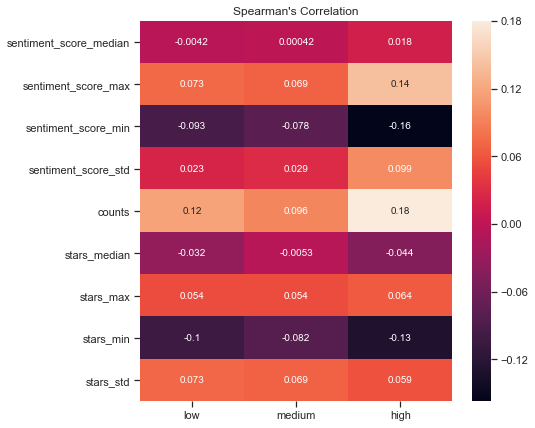

<h1>Table of Contents<span class="tocSkip"></span></h1>
<div class="toc"><ul class="toc-item"><li><span><a href="#Predicting-Restaurants’-Violations-of-Allegheny-County" data-toc-modified-id="Predicting-Restaurants’-Violations-of-Allegheny-County-1"><span class="toc-item-num">1&nbsp;&nbsp;</span>Predicting Restaurants’ Violations of Allegheny County</a></span><ul class="toc-item"><li><span><a href="#Data-Wrangling" data-toc-modified-id="Data-Wrangling-1.1"><span class="toc-item-num">1.1&nbsp;&nbsp;</span>Data Wrangling</a></span><ul class="toc-item"><li><span><a href="#Description-of-the-Data" data-toc-modified-id="Description-of-the-Data-1.1.1"><span class="toc-item-num">1.1.1&nbsp;&nbsp;</span>Description of the Data</a></span></li><li><span><a href="#Processing-of-the-Violation-Dataset" data-toc-modified-id="Processing-of-the-Violation-Dataset-1.1.2"><span class="toc-item-num">1.1.2&nbsp;&nbsp;</span>Processing of the Violation Dataset</a></span></li><li><span><a href="#Finding-the-Common-Restaurants-of-both-Datasets" data-toc-modified-id="Finding-the-Common-Restaurants-of-both-Datasets-1.1.3"><span class="toc-item-num">1.1.3&nbsp;&nbsp;</span>Finding the Common Restaurants of both Datasets</a></span></li><li><span><a href="#Exploration-of-Attributes-and-Categories-Columns" data-toc-modified-id="Exploration-of-Attributes-and-Categories-Columns-1.1.4"><span class="toc-item-num">1.1.4&nbsp;&nbsp;</span>Exploration of Attributes and Categories Columns</a></span></li><li><span><a href="#Processing-the-Texts-of-Reviews" data-toc-modified-id="Processing-the-Texts-of-Reviews-1.1.5"><span class="toc-item-num">1.1.5&nbsp;&nbsp;</span>Processing the Texts of Reviews</a></span></li></ul></li><li><span><a href="#Data-Exploration" data-toc-modified-id="Data-Exploration-1.2"><span class="toc-item-num">1.2&nbsp;&nbsp;</span>Data Exploration</a></span><ul class="toc-item"><li><span><a href="#Types-of-Violations" data-toc-modified-id="Types-of-Violations-1.2.1"><span class="toc-item-num">1.2.1&nbsp;&nbsp;</span>Types of Violations</a></span></li><li><span><a href="#Restaurant-Features-and-Types-of-Violations" data-toc-modified-id="Restaurant-Features-and-Types-of-Violations-1.2.2"><span class="toc-item-num">1.2.2&nbsp;&nbsp;</span>Restaurant Features and Types of Violations</a></span><ul class="toc-item"><li><span><a href="#Some-Visualizations" data-toc-modified-id="Some-Visualizations-1.2.2.1"><span class="toc-item-num">1.2.2.1&nbsp;&nbsp;</span>Some Visualizations</a></span></li><li><span><a href="#Mutual-Information-between-Categorical-Features-and-the-Number-of-Violations" data-toc-modified-id="Mutual-Information-between-Categorical-Features-and-the-Number-of-Violations-1.2.2.2"><span class="toc-item-num">1.2.2.2&nbsp;&nbsp;</span>Mutual Information between Categorical Features and the Number of Violations</a></span></li></ul></li><li><span><a href="#Historical-Information-of-Past-Inspections" data-toc-modified-id="Historical-Information-of-Past-Inspections-1.2.3"><span class="toc-item-num">1.2.3&nbsp;&nbsp;</span>Historical Information of Past Inspections</a></span></li><li><span><a href="#Analysis-of-Text-Reviews" data-toc-modified-id="Analysis-of-Text-Reviews-1.2.4"><span class="toc-item-num">1.2.4&nbsp;&nbsp;</span>Analysis of Text Reviews</a></span></li><li><span><a href="#Concluding-Remarks" data-toc-modified-id="Concluding-Remarks-1.2.5"><span class="toc-item-num">1.2.5&nbsp;&nbsp;</span>Concluding Remarks</a></span></li></ul></li><li><span><a href="#In-Depth-Analysis---Building-Predictive-Models" data-toc-modified-id="In-Depth-Analysis---Building-Predictive-Models-1.3"><span class="toc-item-num">1.3&nbsp;&nbsp;</span>In-Depth Analysis - Building Predictive Models</a></span><ul class="toc-item"><li><span><a href="#Data-splitting-&amp;-Encoding" data-toc-modified-id="Data-splitting-&amp;-Encoding-1.3.1"><span class="toc-item-num">1.3.1&nbsp;&nbsp;</span>Data splitting &amp; Encoding</a></span></li><li><span><a href="#Nested-Cross-Validation" data-toc-modified-id="Nested-Cross-Validation-1.3.2"><span class="toc-item-num">1.3.2&nbsp;&nbsp;</span>Nested Cross-Validation</a></span></li><li><span><a href="#Regression-Version-of-the-Problem" data-toc-modified-id="Regression-Version-of-the-Problem-1.3.3"><span class="toc-item-num">1.3.3&nbsp;&nbsp;</span>Regression Version of the Problem</a></span><ul class="toc-item"><li><span><a href="#Training-Regression-Models" data-toc-modified-id="Training-Regression-Models-1.3.3.1"><span class="toc-item-num">1.3.3.1&nbsp;&nbsp;</span>Training Regression Models</a></span></li><li><span><a href="#Feature-Selection-with-Regression-Problem" data-toc-modified-id="Feature-Selection-with-Regression-Problem-1.3.3.2"><span class="toc-item-num">1.3.3.2&nbsp;&nbsp;</span>Feature Selection with Regression Problem</a></span></li><li><span><a href="#Final-Model-Tuning-&amp;-Performance-on-Test-Set" data-toc-modified-id="Final-Model-Tuning-&amp;-Performance-on-Test-Set-1.3.3.3"><span class="toc-item-num">1.3.3.3&nbsp;&nbsp;</span>Final Model Tuning &amp; Performance on Test Set</a></span></li></ul></li><li><span><a href="#Classification-Version-of-the-Problem" data-toc-modified-id="Classification-Version-of-the-Problem-1.3.4"><span class="toc-item-num">1.3.4&nbsp;&nbsp;</span>Classification Version of the Problem</a></span><ul class="toc-item"><li><span><a href="#Training-Classification-Models" data-toc-modified-id="Training-Classification-Models-1.3.4.1"><span class="toc-item-num">1.3.4.1&nbsp;&nbsp;</span>Training Classification Models</a></span></li><li><span><a href="#Feature-Selection-with-Classification" data-toc-modified-id="Feature-Selection-with-Classification-1.3.4.2"><span class="toc-item-num">1.3.4.2&nbsp;&nbsp;</span>Feature Selection with Classification</a></span></li><li><span><a href="#Final-Model-Tuning-&amp;-Performance" data-toc-modified-id="Final-Model-Tuning-&amp;-Performance-1.3.4.3"><span class="toc-item-num">1.3.4.3&nbsp;&nbsp;</span>Final Model Tuning &amp; Performance</a></span></li></ul></li><li><span><a href="#Possible-Additional-Works" data-toc-modified-id="Possible-Additional-Works-1.3.5"><span class="toc-item-num">1.3.5&nbsp;&nbsp;</span>Possible Additional Works</a></span></li><li><span><a href="#Concluding-Remarks-&amp;-Recommendations" data-toc-modified-id="Concluding-Remarks-&amp;-Recommendations-1.3.6"><span class="toc-item-num">1.3.6&nbsp;&nbsp;</span>Concluding Remarks &amp; Recommendations</a></span></li></ul></li></ul></li></ul></div>

# Predicting Restaurants’ Violations of Allegheny County

Local public health departments regularly inspect food facilities to ensure they’re following safe food handling measures. These inspections check if proper procedures are being taken to protect food from contaminations, and that there is no health risk on consumers (such as food poisoning and spread of Salmonella). In Allegheny County, these inspections are mandatory, done annually and sometimes twice a year, and they happen unannounced. The inspections of this county aim to uncover any critical violations in food handling such as improper cooking practices, holding food at the wrong temperature or inadequate hand washing facilities, and non-critical such as insufficient ventilation or inadequate lighting. If violations are found during the inspection, a re-inspection is scheduled. Failure to fix the violations may result in administrative intervention, civil penalties (fines), or facility closure, depending on the severity and frequency of the violations. However, due to shortage in staff, many restaurants in Allegheny County are not recently being inspected, which means that some violations are going unchecked. According to this [article](https://www.post-gazette.com/business/healthcare-business/2019/03/28/allegheny-county-health-department-restaurant-inspections/stories/201903270138), numerous prominent restaurants and kitchens in the Downtown region haven’t been inspected since 2017. This is why it could be helpful for the county to know how to prioritize its inspections and to first check restaurants where violations are more likely to occur. 

Allegheny county, has made available online, through its [website](https://data.wprdc.org/dataset/allegheny-county-restaurant-food-facility-inspection-violations), the restaurants’ violations collected from January 2016 to present. This dataset is updated monthly and currently has around 238,859 entries with the following fields: facility name, business start date, description of the facility, location, inspection date and times, violation category, rating (V indicates violation), low (low risk violation), medium (medium risk violation), high (high risk violation) and a link to the full inspection report. This dataset can be combined with the dataset provided by [Yelp](https://www.yelp.com/dataset/challenge), in order to see if the reviews help in predicting the violation of a restaurant. The Yelp dataset contains business data including location, attributes, and categories, as well as full review texts, tips, and user information. By looking into these two datasets, we aim at exploring the features of restaurants, their historical performance and their yelp reviews, and build a model that identifies which restaurants are more likely to make future violations.

The model can help Allegheny County with their inspection efforts. It can improve the inspection process by identifying which restaurants to target first, reducing the number of violations missed and detecting any risks earlier. The model can also help consumers getting better views about the food handling practices of any restaurant they plan to visit.

This report is divided as follows. We first describe the datasets of Allegheny county and Yelp reviews, we explain the cleaning steps performed on the datasets before merging them. We also explain  the preprocessing steps done to the text reviews. Once the data is clean, we visually and statistically explore the information provided by the data, we create additional columns that capture the historical performance of the restaurants and apply topic modeling and sentiment analysis to the reviews. We end up with building a predictive model that predicts restaurant performances of a future inspection (in terms of failing or passing the inspection).

## Data Wrangling

In this section, we outline the steps done to clean the inspection dataset of Allegheny county and the business dataset from Yelp, and how we found the common restaurants mentioned in both datasets. The Jupyter notebook of this section can be found [here](https://github.com/hsalami/Springboard/blob/master/Capstone%20Project%202/Data%20Wrangling/Data%20Wrangling%201%20.ipynb).

### Description of the Data

**Violation dataset:** The county of Allegheny keeps a record of each inspection done and the violation found in each inspection. The dataset is available from the [website](https://data.wprdc.org/dataset/allegheny-county-restaurant-food-facility-inspection-violations) of the county. Each row corresponds to an inspection instance and includes the following information about the inspection: the identification number of each inspection, the date and time of the inspection, and the number of "low", "medium" and "high" violations detected during the inspection. Each row also specifies some information about the inspected place: facility name, business starting date, restaurant category, and address. Also each restaurant is identified by an identification number (ID). Multiple rows could belong to the same inspection of a given restaurant, since each row belongs to one violation and multiple violations could be found at the same restaurant during an inspection.

**Yelp Business Dataset**: Two of the files provided by Yelp datasets are business and review files (json files). The business file includes information about the restaurants and associates each restaurant with an identification number. The review file contains Yelp text reviews for each restaurant. In this section, we focus on the business dataset, which contains the name, address, attributes and categories of each restaurant, as well as the number of stars and reviews given to each restaurant. Moreover, each restaurant of Yelp dataset is associated with a business identification number (business ID). Our target is that after we process the violation and business datasets, we want to map the ID of the restaurants in the violation dataset to the business ID of the restaurants in the Yelp dataset.

### Processing of the Violation Dataset

We now focus on cleaning the violation dataset. We first address the issue of some missing entries, we then group the data by inspection and count the number of each type of violations found in each inspection, and finally fix some of the inconsistencies in the names and IDs of the facilities inspected. 

**Filling the Missing Entries**: The data contains some missing entries related to the following restaurants' information: facility name, business starting date, description and addresses. Those are important information that we will use to find the common restaurants between the two datasets. To fill the corresponding missing entries, we first use an additional dataset provided by the county website that specifically contains the information of the inspected facilities. After using the facility dataset, we fix some additional inconsistencies observed in the name of streets given to restaurants that are in Pittsburgh airport; more specifically, we unify the addresses of all airport's restaurants. We also manually fill some additional missing entries in the street names by focusing on the mostly empty entries. We leave the remaining entries to be filled when we combine the violations dataset with the yelp business dataset. We finally remove some redundant rows where facility name was filled as test. 

**Counting each Type of Violation per Inspection**: Each row of the dataset represents a specific category of violation detected during an inspection, that is classified as low, medium or high violation. Since multiple types of violation could be detected during an inspection, multiple rows in the dataset can correspond to the same inspection. We transform the violations dataset into a new one, where each row represents one inspection and includes the total number of each type of violation detected.

**Processing the Names of facilities**: While exploring the violation data, we notice that one same restaurant can have its name spelled differently by the inspectors causing it to have multiple ID numbers. To address this issue, we first process the names of facilities to make them consistent. We then adjust the IDs of the restaurants that have multiple IDs, by checking the restaurants that have same name and address but different IDs. We also notice that one same restaurant can have different street numbers (for instance instead of 424 Beaver st, we have 428 Beaver St.), causing it to also have multiple IDs. We adjust the IDs of those restaurants, by checking the restaurants that have same name, same number name, same zip code but different IDs, and then checking their street numbers. If their street numbers are close, we adjust the IDs.

### Finding the Common Restaurants of both Datasets

To map the restaurants of the violation dataset to the restaurants of Yelp dataset, we rely on the name and address of the restaurants. We first map the restaurants that have the same name in both datasets, and then we only keep the restaurants with same street name and zipcode (because restaurants with same name can have many branches). We then map the restaurants where one name is a substring of the other name, this is because the names of some restaurants are inconsistent between the two datasets. We then check their address and keep the restaurants with same address.

After having found the common restaurants in both datasets based on their names and addresses, we fix some additional inconsistencies that were not solved by the previous processing steps. In particular,

- we remove any incorrect mappings (based on our observations);
- we check if any restaurant from Yelp dataset is mapped to more than one restaurant from violation dataset (because same restaurants can have names spelled differently), we adjust the IDs of these restaurants;
- we check if any restaurant from violation dataset is mapped to more than one restaurant from Yelp dataset. we adjust the business IDs of these restaurants.

We end up with a mapping between the restaurants of the violation dataset and the restaurants of the Yelp business dataset. We then merge the two datasets; each row in the data now contains, in addition to the inspection details, some attributes and categories of the inspected place provided from yelp business dataset. We next explore these additional columns.

### Exploration of Attributes and Categories Columns

We examine the content of the columns "attributes" and "categories" from the business dataset, and transform each attribute and each category to one column. 

**"Attributes" Columns**: For each restaurant, a set of attributes is assigned, for instance, these attributes can specify the ambience, price range and business parking of the restaurants. We transform each of these attributes into one column in the same data frame. Since these attributes are not all mentioned for all restaurants, we remove the attributes that are mostly empty. We also remove some of the attributes that we do not find relevant for violations' predictions. The remaining attributed are the following: Ambience, Alcohol, Good For Kids, Restaurants Good For Groups, and Restaurants Price Range. We also expand the ambience attribute and obtain the following additional columns: 'casual', 'classy', 'divey', 'hipster', 'intimate', 'romantic', 'touristy', 'trendy', 'upscale'. Each entry in the attributes columns is either "False" or "True" (indicator). We fill any empty entry as "unknown". 

**"Categories" Columns**: The "categories" column specifies some characteristics of the place, as well as the type of cuisine or any specific foods served. We extract from this column three columns: "place", "cuisine", "special_food". The column "place" will have some characteristics of the place, the column "cuisine" will specify what type of cuisine is served and the column "special_food" includes if the restaurant serves any specific food.

### Processing the Texts of Reviews
The Yelp dataset also provides a file for the text reviews. Before merging the review texts with the inspection dataset, we process the texts by removing stop words, accented characters and some special characters, expanding the contractions, and replacing the words with their lemmas, using the libraries: spacy and nltk. (The Jupyter notebook of this section can be found [here](https://github.com/hsalami/Springboard/blob/master/Capstone%20Project%202/Data%20Wrangling/Data%20Wrangling%202%20-%20Processing%20of%20Text%20Reviews.ipynb)).

## Data Exploration

After having cleaned the violation and business datasets, we now explore how the information and attributes of the restaurants are associated with the type of violation detected during inspection of the restaurants.

The inspection and Yelp datasets provide several information about each restaurant, which includes: location, description of the place, starting business date, number of star reviews, total number of reviews, cuisine served, special food served and some characteristics of the place. The inspection dataset also includes inspection time and results (number of low, medium and high violations), and Yelp dataset includes text reviews for each restaurant. By examining this information, we would like to know which features help in identifying the restaurants that are more likely to make a violation.

In particular, we analyze both datasets and examine if violations are changing across time and season, and if they are following any trends. Do they occur more in restaurants, grocery stores, food facilities in schools, or other places? Are there any differences in the number of violations between chain and non-chain restaurants? In which regions of Allegheny county, the violations are focused? How does the age of restaurants affect their inspection results? Do old restaurants follow regulations more thoroughly? How do popular, high star review and expensive restaurants perform in terms of hygiene? In which cuisine, do violations occur more? Do restaurants with high number of violations serve a specific type of food? Can text reviews help in identifying any possible violation? Can the historical performance of the restaurants help in predicting future performances? In this section, we address those questions to gain more insight about the circumstances of each type of violations. (The Jupyter notebbok of this section can be found [here](https://github.com/hsalami/Springboard/blob/master/Capstone%20Project%202/Data%20Story/Data%20Story.ipynb)).

### Types of Violations

During each inspection of a given restaurant, all detected violations are classified into low, medium or high violation, and multiple violations can be found during same inspection. Let us check which type of violation is more common and if there is any trend in their occurrences across time.

*How many low, medium and high violations occur per Inspection?* To check how large each number of violation can be per inspection, we examine their distribution by plotting the box plot of each.


We see that the number of low violation per inspection is more spread out than that of medium and high violations. Also, the number of low violations found in an inspection can be larger than that of medium and high violations. We also notice that more than 50% of the number of high violations is zero, which means that they are less common than the other two types of violations. If we compute their non-zero percentage, 87% of low violations are non-zero, 53% of medium violations are non-zero and 40% of low violations are non-zero.


*How are violations changing over time?*
Let us now check the evolution of the number of each violation type with time, to see if there is an increase or decrease in their occurrence. We count the average number of each type of violation for each month across the years, and we plot the evolution of the average number of violations.


We see that on average the number of each type of violations is not decreasing with time, which implies the importance of doing regular inspections for the food facilities and restaurants.

### Restaurant Features and Types of Violations

We now explore some of the features of the restaurants and check for any association with the number detected of each number of violation. 

#### Some Visualizations
**Place Description:** The column 'description' provides a brief description of the facility inspected. More specifically, it specifies whether the inspected place is a restaurant, supermarket or convenience store, and whether it belongs to a chain and if it provides liquor. The plot below shows, for each type of place, the average and maximum number of each violation type detected per inspection. 


In the above plots, the less clean food facilities appear in the upper right corner of the plot and the cleaner facilities appear in the lower left corner of the plot. We notice that for all violation types, the high numbers of violations are mainly detected in restaurants. On the other hand, cleaner places are those that provide child food or packaged foods or those that are inside a school or a warehouse. 

**Restaurant Age:** For each restaurant, the business starting date is given in the violation dataset. From this column, we can find the age of the restaurant on the inspection day. Let us check if the fact that the restaurant is new or old can help in predicting the violation type. We plot the number of each violation type with respect to the age of the restaurant (in years).


We mainly notice that in very old restaurants (> 60 years), the numbers of medium and high violations detected were small numbers. Since the total number of old restaurants is much less than the number of non-old restaurants (<40 years), a larger range of violation numbers was detected in non-old restaurants. However, for restaurants with less than 40 years old, we see all range of violations numbers are possible.

**Price Range:** Yelp provides the price range for some restaurants. It is interesting now to check if expensive restaurants makes less violations or not. We now plot the distribution of each violation for each price range.


There is no much difference observed between the ditributions of violation numbers for each price range. What is interesting to note is that expensive restaurants with more than 3 dollars sign do make violations of all types, their range of violation numbers is as spread out as the other restaurants categories.

**Ambience:** Each restaurant is characterized by a specific ambience. The plot below shows, for each type of ambience, the average and maximum number of each violation type detected per inspection.


We notice that 'touristy' restaurants have the highest averages of low and medium violations. On the other hand, the maximum number of low, medium and high violations were detected in 'casual' restaurants.

**Cuisine:** Do certain cuisines make restaurants more prone to make violations in food handling? Let us check the number of violations for each cuisine type. We find the mean and maximum number of violations that occurred in each type of cuisine and we plot the results for each type of violation.


We mainly see that for any type of violation, the following two cuisines: Japanese and Chinese have both high average number of violations and maximum number of violations. We also have the Southern cuisine for low violations

**Special Food:** Each restaurant might be specialized in some type of food: pizza, fast food, sushi, etc.,... If a restaurant serves some  type of food, can this specialization make the restaurant more likely to make a violation?


We see that for low and high violations, places that serve Sushi and Seafood have the largest average number of violations or the largest maximum number of violations. Sushi and Seafood places involve raw fish, whose wrong handling make the restaurants more prone to make violations. On the other hand, for medium violations, we have places that serve Kosher with the highest average violation number.

**Zip Codes:** We now look at the distribution of each type of violations on the map of zip codes of Allegheny County. This can help us identify if there is any neighborhood where low, medium or high violations mostly occur. We plot the choropleth map for each type of violation.


We notice that for the zipcode corresponding to the city of Pittsburgh, low violations were mostly concentrated, however for the same city, medium and high violations were less than those of other cities. Moreover, medium and high violations were more concentrated in the central north parts of Allegheny county and a place in the central south part. It would be interesting to check the economical and social conditions of each of these neighborhoods and link them to the type of violations observed.

#### Mutual Information between Categorical Features and the Number of Violations

We visualized so far the number of low, medium and high violations with respect to some features of the inspected places. Some additional plots can be found [here](https://github.com/hsalami/Springboard/blob/master/Capstone%20Project%202/Data%20Story/Data%20Story.ipynb). In general, apart from the insights that we previously mentioned, the association between the various characteristics of the inspected places and the the number of each type of violation seems to be weak. In this section, we statistically examine the association between each categorical feature and each violation type, especially that there are other features with high cardinality that we did not yet explore. We choose to compute the mutual information between each categorical feature and the number of each type of violation (using mutual_info_regression from sklearn library). "Mutual information (MI) between two random variables is a non-negative value, which measures the dependency between the variables. It is equal to zero if and only if two random variables are independent, and higher values mean higher dependency."


For all type of violation, we see how the weak association between each feature and the number of violation is translated by low level values of mutual information. We notice that the largest values of mutual information correspond to the location features (municipal and zip), time feature (year) and description column. For the remaining columns that specify the cuisine, any special food and place characteristic, the mutual information values showed also to be small. More details can be found [here](https://github.com/hsalami/Springboard/blob/master/Capstone%20Project%202/Data%20Story/Data%20Story.ipynb). 

### Historical Information of Past Inspections

In order to enrich more our data, we create additional columns that capture past historical performance of each inspected place and that include more information about the inspection instance. By adding these columns, we try to examine if there is any trend in the evolution of the number of violations detected. Do restaurants do better than the last time they were inspected? Do regular inspections help in reducing the number of violations? 

We list here the added columns:
1. *Inspection number*: it specifies whether it is the first inspection for the restaurant, or the second and so on; 
2. *Number of days between inspections*: the number of days passed since last inspection day;
3. *Statistics of Past performance*: columns corresponding to lagged values and to rolling statistics of past low, medium and high violations. These columns include the max, median and standard deviations of all past violations detected before the present inspection. They also include the last numbers of low, medium and high violation detected in the last three previous inspection instances and their log ratios as well.

To examine the association between the number of each type of violation and these numerical columns, we compute the Spearman's correlation between them. The Spearman's correlation is a measure that varies between -1 and +1 with 0 implying no correlation and it accounts for non-linear relationship.


We observe the following:
- For low violation, the strongest positive correlation is shown to be with its own past statistics: max_low and std_low, as well as with the number of days passed since last inspection. The strongest negative correlation is shown to be with the log ratio of past medium and high violations;
- For Medium violations, the strongest positive correlation is shown to be with the number of days passed since last inspection. The strongest negative correlation is shown to be with the log ratio of past high violations;
- For high violations, the strongest positive correlation is shown to be with its own statistics: max_high, std_high. The strongest negative correlation is shown to be with the log ratio of past low and medium violations.

Each type of violation shows to have positive correlation with its past performance translated by the rolling maximum and standard deviation measures. Each type of violation also shows negative correlation with the log ratio of past violations of the other type. Also the number of days between two consecutive inspections positively correlates with each type of violation, this might imply the importance of regular inspections. 


### Analysis of Text Reviews

The last piece of information available in our data that we now examine is the Yelp reviews. To analyze them, we perform sentiment analysis of the reviews and topic modeling. The first one (sentiment analysis) helps us in examining if positive and negative feedbacks can be associated with the type of violation detected. The second one (topic modeling) helps extracting important topics mentioned in the reviews that might be associated with the type of violation detected.

**Sentiment Analysis**: To perform sentiment analysis on the text reviews, we use afinn library to compute a sentiment score for each text review. We then compute the rolling statistics of the sentiment scores to add them as additional columns to the data. For each inspection, we focus on the sentiment scores of all reviews mentioned before the inspection date and find their mean, maximum, minimum, and standard deviation statistics. For each inspection, we also add the total number of reviews and the average number of stars given to the restaurant before the inspection date.



We notice that the statistics of the sentiment scores did not show strong association with the type of violation detected except for the minimum sentiment score that showed the strongest negative correlation with the number of high violations. Moreover, the total number of reviews (counts) as well the minimum number of stars given to restaurants showed stronger association with the number of violations than the other measures. 

**Topic Modeling**: To perform topic modeling, we consider for each inspection, all reviews that were mentioned before the inspection date. We then transform the reviews into a bag of words representation and using non-negative matrix decomposition (NMF), we extract 5 topics from the reviews. The top 10 words of each topic are as follows:

*Topic 1: bar beer wing drink place good bartender great burger night*

*Topic 2: pizza order delivery good crust place cheese wing sauce get*

*Topic 3: food good order go get place service restaurant come time*

*Topic 4: coffee store get place go shop good one like make*

*Topic 5: chinese sushi food roll good chicken rice order place thai*

Let us check the how the vector of topics of each inspection correlate with low, medium and high violations.


Topic V4 shows the lowest negative correlation with each type of violation. The main words that constitute topic V4 are: coffee, shop and store. This might mean that the inspected place corresponds to a coffee shop or it is a place for shopping, more than it is a restaurant. High violation has its most significant positive correlation with topic V3, which seems to be related to the service provided by the place. Topic V5 which includes the words: chinese and suhi roll has greater correlation with each type of violation than topics V1 and V2.

### Concluding Remarks

In this section, we explored the inspection and violation datasets visually and statistically; we checked the type of place (restaurant or shopping place), the type of cuisine or any special food served (Sushi and Seafood) in places where great number of violations was detected. We found that the restaurants attributes provide less insight into the possible types of violations that could be detected. Moreover, we noticed that expensive and popular restaurants (with high number of reviews) do make violations of all types. We created additional features that capture the historical performances of the restaurants and found that past performances of each type of violation correlate with the current one. Also, we found that the number of days between inspection correlate significantly with with types of violation, which implies the necessity of doing regular inspections. Finally, we modeled the reviews with 5 topics and found that topic related to the quality of service offered as well as the type of place (coffee, shopping place) correlate the most with the number of violations detected.

## In-Depth Analysis - Building Predictive Models

After having explored the restaurants' characteristics and created some features that capture the historical performance of each restaurant, we now focus on building a predictive model that predicts the performance of a given restaurant during a future inspection. The prediction of future performances can be in terms of estimating the number of low, medium and high violations that can be detected during a future inspection, or in terms of classifying a future inspection as a fail or pass. In other words, our problem can be formulated as a regression or classification problem. While the regression problem provides more granularity to know which restaurants to check first (i.e., those with large high violations number), the data might not be rich enough to predict the number of each type of violation which will make the regression a difficult task with the data we have. In this section, we explore both approaches of the problem. 

This section is divided as follows: we first prepare the features columns and the target variables and split the data into training and test sets where the test set consist of future inspections for the training set. We then explain the cross-validation process used here in building the predictive models and in selecting the final model. We then start with the regression problem, pre-process the training set, perform feature selection, train some regression models, check their performance in terms of MSE (mean squared error) and R-squared and select a final model. We also repeat the same steps with the classification version of the problem. We finally finish with the insights provided by the models built (The Jupyter notebook of this section can be found [here](https://github.com/hsalami/Springboard/blob/master/Capstone%20Project%202/In-Depth%20Analysis%20-%20ML/ML-part.ipynb)). 

### Data splitting & Encoding

First, the data is split into:
                            
                            training set: 80% 
                            testing set: 20% 
                            
Note that the test set corresponds to future inspections for the training set.

The data consist of numerical and categorical columns. The latter include both nominal and ordinal columns. We try two types of encoding: one hot encoding and label encoding. Note that while most of the categorical columns have at most three unique values, the columns: description, zip and municipal contain more than 3 unique values (description: 21, zip: 88, municipal: 136). One hot encoding scheme increases in this case significantly the total number of features, which we are going to address later through feature elimination. The ordinal columns consist of the following columns: 'month', 'day', 'year', 'hour', 'inspection number', they all have been assigned integer values, therefore they do not need any encoding.  

### Nested Cross-Validation

Before we start with the training step, we explain here the cross-validation method used to perform feature selection and model selection. Since each instance in our training set corresponds to an inspection on a specific day and holds information about past violations, and since our goal is to predict future performance of restaurants, we are not going to use the regular cross-validation; when we are going to split the training set into sub-training and validations sets, the validation set should consist of subsequent instances for the sub-training set. In particular, we choose the first 60% of the training data as sub-training set and the next 20% of the training data as validation set, then we repeat the same process but now the first 70% of the data represents the sub-training set and the next 20% as validation set and then finally, we use the first 80% of the data as sub-training set and the remaining 20% as validation set. We then compute the average of the performances obtained with each validation set.

### Regression Version of the Problem

#### Training Regression Models
We start with training the data, using our defined nested cross-validation function. The models that we are going to use are: linear support vector regressor (used a baseline model) and tree based models: random forest, ada boost, and gradient boosting regressors. We first start with the default parameters for each model, we use the training data encoded with one hot and ordinal encodings, we also start with all features and compare between the models using mean-squared error and we also look at their R-squared scores.

                                  Averages of cross-validation Accuracies 
     Low Violation:
                                                     
| Models|                      One Hot Encoding - MSE |  R2       | Label Encoding - MSE| R2|
|------|----------------------------------------------|---------- |---------------------|---|                             
|Linear SVR |                                8.045280|  0.008385 |7.814561 | 0.036509|
|Random Forest Regressor|                    5.836208|  0.281117 |5.896790 | 0.273740|
|AdaBoost Regressor   |                       9.030906| -0.112146 |8.236327 |-0.015791|
|Gradient Boosting Regressor |                5.843191|  0.280142 |5.834430 | 0.281412|


     Medium Violation:
                                                     
| Models|                      One Hot Encoding - MSE |    R2  | Label Encoding -  MSE|  R2|
|------|----------------------------------------------|---------- |----|-------- |                            
|Linear SVR |                                1.458459|  0.004655|1.369467|  0.065405|
|Random Forest Regressor|                    1.246249|  0.149597|1.259151 | 0.140800|
|AdaBoost Regressor   |                     2.503747| -0.708556|2.270310 |-0.549595|
|Gradient Boosting Regressor |               1.243516|  0.151465|1.246730  |0.149238|


    High Violation:
                                                     
| Models|                     One Hot Encoding -  MSE |    R2  | Label Encoding - MSE| R2|
|------|----------------------------------------------|---------- |----|--------  |                           
|Linear SVR |                                 0.807403|  0.024286|0.817994|  0.010179|
|Random Forest Regressor|                     0.731271|  0.112643|0.742043|  0.099861|
|AdaBoost Regressor   |                       1.822915| -1.213779|1.476398| -0.788061|
|Gradient Boosting Regressor |                0.690629 | 0.162729|0.699775 | 0.151502|


One Hot Encoding: For low and high violations, we see that Gradient boosting regressor and random forest have  better performance (in terms of lower MSE) than the other two models. With high violations, gradient boosting regressor showed the lowest MSE. 

Label Encoding: With this type of encoding, we notice that gradient boosting classifier always has the lowest MSE for all types of violations. We also notice that gradient boosting with ordinal encoding performed slightly better than with one hot encoding. On the other hand, with medium and high violations, one hot encoding performed better than ordinal encoding.

However, if we look at the score of R-squared, we see that all models are not performing well in terms how well they are fitting the data. We next focus on gradient boosting model and perform feature selection to see if the performance can be boosted.

#### Feature Selection with Regression Problem

We perform feature selection using the filter method. In particular, we compute the mutual information between each feature and the the number of violation for each type. We then drop the features that have 0 mutual information with the target variable. This can help us in removing the redundant features, especially with the one hot encoding scheme that significantly increases the total number of features. We chose the mutual information test over the F-test, because F-test requires some assumptions on the features of the data (normality assumption with same variance), while mutual information do not require that the features hold those assumptions. Moreover, mutual information can detect non-linear relationship between the features and the target variables.

To test whether reducing the number of features can reduce the MSE of the models, we again perform cross-validation, where for each sub-training set we remove the features that have 0 mutual information with the target variable. We compare the obtained results with those obtained when the models considered the total number of features.
         
                                        Averages of cross-validation Accuracies
<table>
<tr><th>Gradient Boosting Performance <br> Feature Selection </th><th> Gradient Boosting Performance <br> Feature Selection</th><th>Gradient Boosting Performance <br> Feature Selection</th></tr>
<tr><td>
    
|Low Violation |   Mean Squared Error | R2 Score|
|--------------|----------------------|---------|
|One Hot Encoding |     5.850644 | 0.279305|
|Label Encoding    |5.836886 | 0.281165|

</td><td>
    
|Medium Violation |   Mean Squared Error | R2 Score|
|--------------|----------------------|---------|
|One Hot Encoding                 |   1.23661|  0.156163|
|Label Encoding                    | 1.247337 | 0.148848|

</td><td>

|High Violation |   Mean Squared Error | R2 Score|
|--------------|----------------------|---------|
|One Hot Encoding                             |0.691962|  0.161294|
|Label Encoding                               |0.699358 | 0.152308|

</td></tr> </table>

One hot Encoding: If we compare those results with the ones obtained from the total number of features, we notice that for low and high violations (with one hot encoding), the MSE and R2 scores are close (slightly better with the complete number of features), and with medium violations the MSE and R2 scores are better with less features. 

Label Encoding: We notice that with low violations, performing ordinal encoding with feature selection gave the best MSE score. For medium violations, performing one hot encoding with feature selection gave the best MSE score. For high violations, performing one hot encoding without feature selection gave the best MSE score. We next focus on these combinations and fine-tune the models. 

#### Final Model Tuning & Performance on Test Set

To check if we can obtain an additional boost in the performance of the gradient boosting model for each type of violation, we fine-tune some of its parameters, and we use nested cross validation to find the best parameters. We then rebuild these models using the whole training set and check their performance on the test set. The obtained performance is as follows:
   
    Low Violations: MSE: 5.832756214471463 R2: 0.24033434619115324
    Medium Violations: MSE: 1.3046813152332875 R2: 0.15682566866445458
    High Violations: MSE: 0.7639406850414634 R2: 0.12615197445631632

As expected, the models do not fit well the data, which suggests that regression here is a difficult task with the data we have. Let us know try the second approach of the problem: classification, to see if we can instead detect the set of restaurants that might fail a future inspection (instead of estimating the possible number of violations that can be detected).

### Classification Version of the Problem

We now focus on the classification version of the problem. Since estimating the number of possible violations turned out to be a difficult task for our data, detecting the set of possible restaurants that could fail a future inspection might be an easier task. failing an inspection, we assume that at least one high violation or at least 2 medium violations were detected during the inspection. Using this assumption, we create the target variable so that '1' means 'Failed' and '0' means 'Passed'. The proportions of the two classes are close to each other (52%: '0', 48%: '1'), we do not have problems with class imbalances. We next train some classification problems, perform again feature selection and then fine tune the chosen model.

#### Training Classification Models
To compare between the models, we again use our nested cross validation function and the performance is evaluated based on the average accuracy of the models. The models we are going to train are: logistic regression (used as baseline), and tree based classifiers (random fores, ada boost and gradient boosting). We obtain the following accuracies.

                                       Averages of cross-validation Accuracies
|Models|                One Hot Encoding| Label Encoding
|-------------|-------------------------|---------------                      
|Logistic Regression  |         0.586462|0.617292
|Random Forest Classifier|      0.659954|0.665529
|AdaBoost Classifier     |      0.658362|0.662344
|Gradient Boosting Classifier|  0.673834|0.674858


We noticed that gradient boosting classifier also performed the best between the models in terms of accuracy.  With both encoding schemes, we obtained similar accuracy scores. We next focus only on gradient boosting classifier and check if reducing the number of features can enhance the accuracy scores of the model. We check both encoding schemes

#### Feature Selection with Classification

To perform feature selection, we again use the filter method with the score function mutual information. We obtained the following performance.

    One Hot Encoding with Feature Selection: 0.66916951
    Label Encoding with Feature Selection: 0.67360637

The accuracy we obtained here is also close to what we obtained with label encoding using the complete number of features. However, since the accuracy is better with label encoding without feature selection, we are going next to focus on this combination (label encoding without feature selection) to fine-tune the gradient boosting classifier.

#### Final Model Tuning & Performance

After having chosen the combination of label encoding and gradient boosting classifier with no feature selection, we focus on fine-tuning some of the parameters of the gradient boosting classifier. The parameters are: "n_estimators", "learning_rate" and "max_depth". We then train our final model on the whole training set and check its performance on our testing set.

    Accuracy of the Final Model on Testing set: 67.65%
    
The accuracy is 67.65%, which is expected (the score is close to the ones we obtained when we have used cross validation on the training set). Let us look at the feature importances provided by the final model. We plot the features importance of the top 10 features.


We see that the most important feature is "days_between" which specifies the number of days that are between two consecutive inspections. We also notice that the month of the inspection is another important feature, which suggests the presence of some seasonal impacts that affect the restaurant performance. Moreover, past violations in terms of maximum number of high violations so far detected and the last number of high violations detected at a given restaurant are in the top 10 features, which suggests the importance of historical performance of restaurants. The topics modeled from the reviews (V3 and V4) also contributed to the performance of the final model. The feature "Restaurants" specifies if the inspected place is a restaurant or another type of food facility, this indicator represents also an important feature as we have already noticed from visualizing our data.

To check how the model is performing in predicting the true and negative labels, we plot the confusion matrix and compute the precision and recall scores for each class.


                                        Class: 1 (Fail)         Class: 0 (Pass)
                                        Precision: 0.67         Precision: 0.68
                                        Recall 0.74             Recall: 0.60
    

While the model is able to recall 74% of the failed inspections (recall for class 1: 74%), the precision for class 1 is 67% which represents the ratio of how many of the predicted failed inspections did actually fail. We have two goals for the inspectors: the first goal is to not let them miss inspecting the restaurants that are making serious violations, the second goal is to help the inspectors prioritize their efforts and be efficient in inspecting first the restaurants that will fail. The first goal can be measured by the precision score, while the second goal can be measured by the recall score. With the current information in our data, we were not able to get an accuracy above 67%; this suggests that if we need to get a better accuracy for our model (more instances from both classes that are correctly classified, more positive instances that are correctly classified enhance the recall score, more negative instances that are correctly classified enhance the precision score), more historical data need to be collected and more information about each restaurant need to specified.

### Possible Additional Works

One additional idea that we can try when building the predictive model is to aggregate different types of classification models in addition to the gradient boosting classifier. While model's aggregation might help enhancing the accuracy of the model, we do not expect that the performance will be enhanced a lot, because the low performances of regression and classification versions of the problem suggest that the data we have is not informative enough to get better performance.

While processing the text reviews, we used some readily available functions and did not check in details other options or strategies in analyzing the text reviews. It might be helpful to check again this part of the project and check if it can be enhanced. 

The city of Allegheny County has also on its website, another data for restaurants' inspections that describes the instances where no type of violation was detected at all. We can use this additional dataset with the violation dataset, to compare between the circumstances of the places that made violations and the places that did not make any violation at all. Also each inspection comes with a report, that we can explore to extract information related to the inspection.

### Concluding Remarks & Recommendations

While exploring the data, we found that one of the factor that showed the greatest association with the violation detected is the number of days passed since last inspection. This suggests the importance of doing regular inspections and that inspectors may start inspecting the restaurants that have not been inspected for a while.

Moreover, collecting more information related to the inspected place and its neighborhood might be helpful and might enhance the performance of the predictive model. For instance, information related to the workers in the restaurants (number of employees, their level of expertise, their culinary background, information about the manager, size of the business), or information related to the most times at which each restaurant is busy might all be helpful. Also many of the attributes and categories for many of the restaurants were not specified and were left empty, having them be specified might also be helpful. Moreover, when we looked at the reviews we noticed that some restaurants did not have reviews for some periods of time, and we also noticed that even if the restaurant is providing satisfactory services for its customers, it can still make violations. Therefore, encouraging people to leave more reviews that are not only related to the food served but also to the level of cleanness noticed in the restaurants (restrooms, utensils, quality of food served in terms of freshness) can also be helpful.


```python

```
